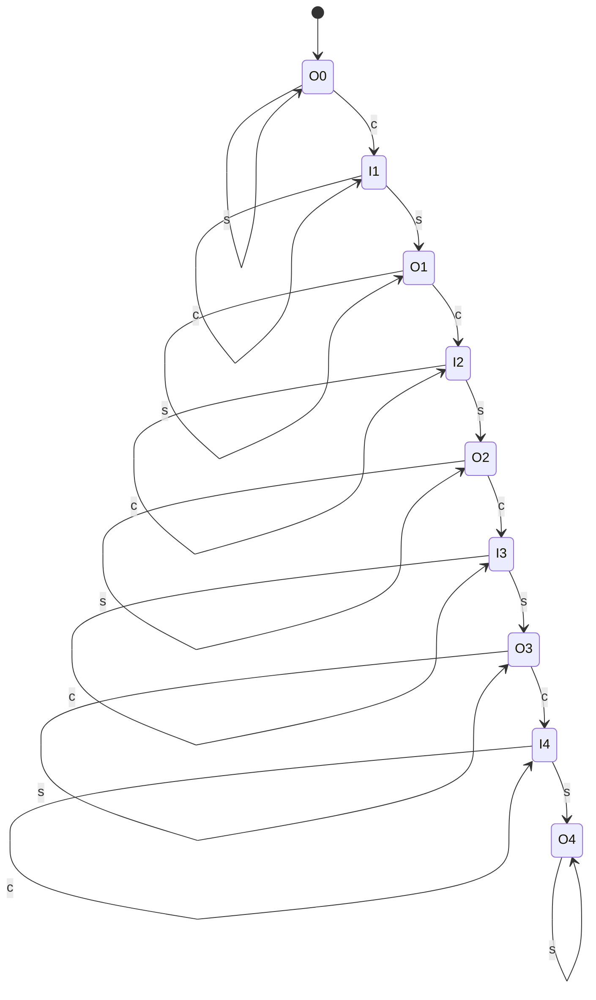
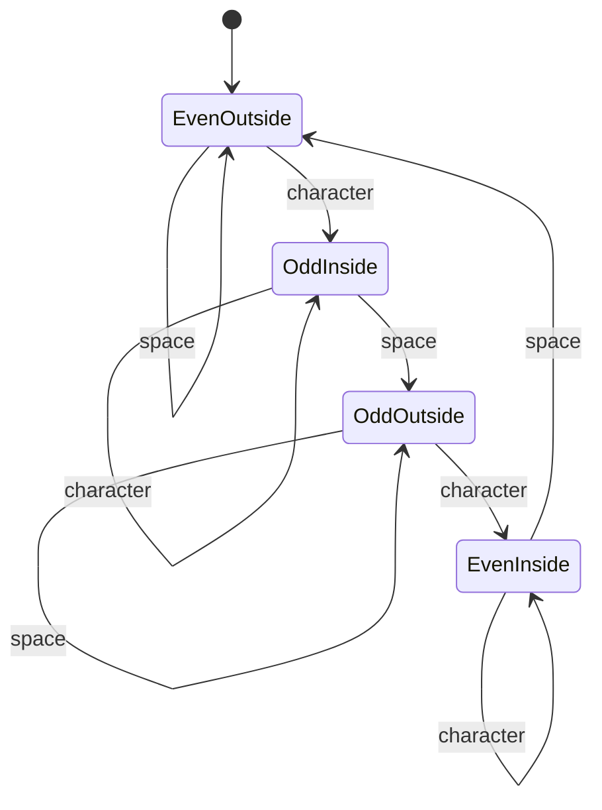
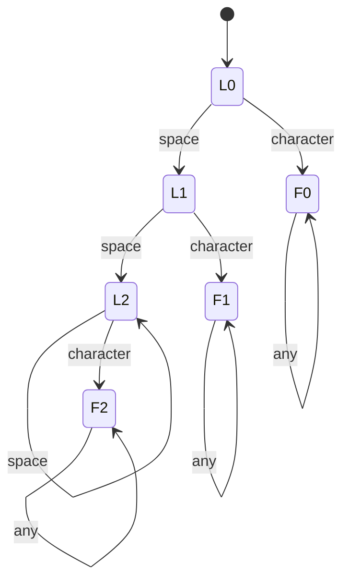
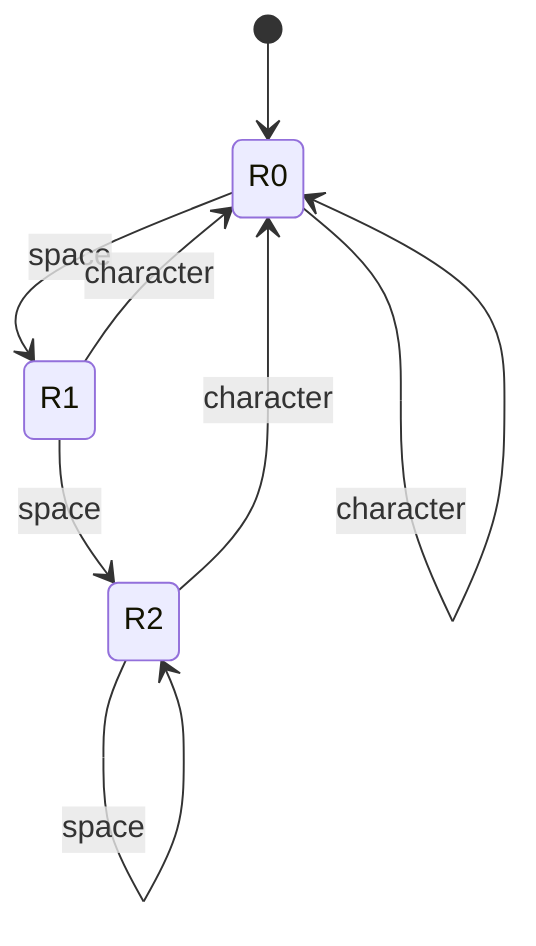

# A&Q
____
 **Question 114 draw a finite state machine to count the words in the input string. the input length is no more than eight symbols**

I treat a word as a sequence of characters that are not spaces. I count a new word when I move from a space to a normal character, or when the string starts with a normal character.

`O` means I am outside a word, `I` means I am inside a word, and the number is how many words I have counted. Here, `s` is a space and `c` is any other character.



At the end of the input, I return the number in the current state. For example, `I3` means three words, even if there is no space after the last word.

With at most eight characters, I can have at most four words: `a b c d` already takes seven characters. Another character after reaching `O4` would exceed the length limit. If I also want to handle longer input, I can send that transition to an error state.

**Question 115 draw a finite state machine to check whether there is an even or an odd number of words in the input string.**

Here I do not need the exact number of words. I only need to know whether it is even or odd. I switch between even and odd only when a new word starts.



At the end of the input, a state starting with `Even` means an even number of words, and a state starting with `Odd` means an odd number. Zero words is also an even number.

 **Question 116 draw and implement a finite state machine to answer whether a string should be trimmed from left, right, or both or should not be trimmed at all. a string should be trimmed if it starts or ends with consecutive spaces.**

I understand “consecutive spaces” as two or more spaces in a row. With that interpretation, one space at an edge does not require trimming. I check the normal space character `' '`, not tabs or newlines.

I split the state into two parts: the spaces at the beginning and the spaces at the end. Both counts stop at 2 because I do not need to distinguish between three spaces and ten spaces.

For the left side, `L` means I am still reading the initial spaces. `F` means I have reached a normal character, so the left-side result is fixed:



For the right side, I keep track of the latest run of spaces:



The full machine's state is a pair of these states. At the end, a left-side count of 2 means trim left, and `R2` means trim right.

```python
def trim_side(text):
    left = 0
    right = 0
    still_at_start = True

    for char in text:
        if still_at_start:
            if char == ' ':
                left = min(left + 1, 2)
            else:
                still_at_start = False

        if char == ' ':
            right = min(right + 1, 2)
        else:
            right = 0

    if left == 2 and right == 2:
        return 'both'
    if left == 2:
        return 'left'
    if right == 2:
        return 'right'
    return 'none'
```

For example, `"  hello"` returns `left`, and `"  hello  "` returns `both`. A string containing only two spaces also returns `both`. If the question means trimming even one space, I change the final checks from `== 2` to `>= 1`.

**Question 117 using any language you know, implement a grep analogue based on NFA construction.**

I implement this in Python. First, I build an NFA from the expression using Thompson construction. Then I read each line and keep the set of all states the machine could currently be in.

A `None` transition is an epsilon transition, so it does not consume a character. To find matches anywhere in a line, I add the initial states again at each step.

This implementation supports normal characters, concatenation, `|`, parentheses, `*`, `+`, `?`, the dot, and escaped characters. It does not implement every grep feature, such as `^` and `$` anchors or character classes like `[a-z]`.

```python
import sys

class NFA:
    def __init__(self, pattern):
        self.pattern = pattern
        self.pos = 0
        self.edges = []
        self.start, self.end = self.expression()
        if self.pos != len(pattern):
            raise ValueError('Unexpected character')

    def state(self):
        self.edges.append([])
        return len(self.edges) - 1

    def peek(self):
        return self.pattern[self.pos:self.pos + 1]

    def expression(self):
        start, end = self.sequence()
        while self.peek() == '|':
            self.pos += 1
            right_start, right_end = self.sequence()
            new_start, new_end = self.state(), self.state()
            self.edges[new_start] += [(None, start), (None, right_start)]
            self.edges[end].append((None, new_end))
            self.edges[right_end].append((None, new_end))
            start, end = new_start, new_end
        return start, end

    def sequence(self):
        start = end = self.state()
        while self.peek() and self.peek() not in ')|':
            part_start, part_end = self.repetition()
            self.edges[end].append((None, part_start))
            end = part_end
        return start, end

    def repetition(self):
        start, end = self.atom()
        if self.peek() and self.peek() in '*+?':
            operator = self.peek()
            self.pos += 1
            new_start, new_end = self.state(), self.state()
            self.edges[new_start].append((None, start))
            self.edges[end].append((None, new_end))
            if operator in '*?':
                self.edges[new_start].append((None, new_end))
            if operator in '*+':
                self.edges[end].append((None, start))
            start, end = new_start, new_end
        return start, end

    def atom(self):
        token = self.peek()
        self.pos += 1
        if token == '(':
            fragment = self.expression()
            if self.peek() != ')':
                raise ValueError('Missing closing parenthesis')
            self.pos += 1
            return fragment
        if not token or token in '*+?':
            raise ValueError('Missing expression before operator')
        if token == '\\':
            token = self.peek()
            if not token:
                raise ValueError('Missing escaped character')
            self.pos += 1
            label = ('char', token)
        elif token == '.':
            label = ('any', '')
        elif token in '^$[]':
            raise ValueError('Anchors and character classes are not supported')
        else:
            label = ('char', token)
        start, end = self.state(), self.state()
        self.edges[start].append((label, end))
        return start, end

    def closure(self, states):
        result = set(states)
        pending = list(result)
        while pending:
            for label, destination in self.edges[pending.pop()]:
                if label is None and destination not in result:
                    result.add(destination)
                    pending.append(destination)
        return result

    def search(self, text):
        initial = self.closure({self.start})
        active = set(initial)
        if self.end in active:
            return True
        for char in text:
            destinations = {
                destination
                for state in active
                for label, destination in self.edges[state]
                if label is not None and
                (label[0] == 'any' or label[1] == char)
            }
            active = self.closure(destinations) | initial
            if self.end in active:
                return True
        return False

if __name__ == '__main__':
    if len(sys.argv) != 3:
        raise SystemExit('Usage: python3 nfa_grep.py PATTERN FILE')
    try:
        nfa = NFA(sys.argv[1])
        matched = False
        with open(sys.argv[2], encoding='utf-8') as source:
            for line in source:
                if nfa.search(line.rstrip('\n')):
                    print(line, end='')
                    matched = True
        raise SystemExit(0 if matched else 1)
    except (ValueError, OSError) as error:
        print(error, file=sys.stderr)
        raise SystemExit(2)
```

I save the code as `nfa_grep.py` and run it like this:

```sh
python3 nfa_grep.py 'a(b|c)*d' input.txt
```

The program prints lines containing a match. Its exit status is 0 if it finds a match, 1 if it finds none, and 2 if an error occurs.

**Question 118 study this regular expression: ˆ1?$|ˆ(11+?)\1+$. What might be its purpose? imagine that the input is a string consisting of characters 1 uniquely. how does the result of this regular expression matching correlate with the string length?**

This expression checks whether the length of a string of `1` characters is not prime:

```regex
^1?$|^(11+?)\1+$
```

The first part, `^1?$`, matches an empty string or a single `1`. The lengths 0 and 1 are not prime.

The group `(11+?)` captures at least two `1` characters. Then `\1+` requires the same group to appear again at least once. If the whole string can be split into those repetitions, its length is a product of two numbers that are both at least 2.

For example, `111111` matches because it can be split into three groups of `11`, so 6 is not prime. `11111` does not match because 5 is prime.

For input containing only `1`, a match means “not prime” and no match means “prime”. The `?` after `+` makes the engine try shorter groups first, but it does not change the final result.

Here, `\1` is a backreference. That is an extension supported by some regex engines, not a regular expression in the strict finite-automaton sense.

**Question 119 What is the difference between our approach (indirect threaded code) and direct threaded code and subroutine threaded code? What advantages and disadvantages can you name?**

In our implementation, a word's body contains execution tokens. Each token points to a cell containing a code address, so `next` needs another memory lookup before jumping.

| Method | What the word's body contains | Advantage | Disadvantage |
|---|---|---|---|
| Indirect threaded | Pointers to cells containing code addresses | Easy to share `docol` and separate a word's code from its body | An extra level of indirection during dispatch |
| Direct threaded | Direct code addresses | Avoids that extra lookup during dispatch | Composite words need a suitable code entry; the implementation depends more on the architecture |
| Subroutine threaded | Machine instructions such as `call` | The processor handles calls directly, and the generated code can be optimized | Code size and call/return costs depend on the processor and implementation |

I would not say that one method is always the fastest. It also depends on branches, the cache, and optimizations. [Threaded code explanation](https://www.complang.tuwien.ac.at/forth/threaded-code.html).

 **Question 120 look the documentation for commands sete, setl, and their counterparts.**

These instructions write either 1 or 0 to a byte, depending on the flags set by an earlier instruction, usually `cmp`.

| Instruction | Condition |
|---|---|
| `sete` / `setz` | Equal: `ZF = 1` |
| `setne` / `setnz` | Not equal: `ZF = 0` |
| `setl` | Signed less than: `SF != OF` |
| `setle` | Signed less than or equal |
| `setg` | Signed greater than |
| `setge` | Signed greater than or equal |
| `setb` | Unsigned below: `CF = 1` |
| `setbe` | Unsigned below or equal |
| `seta` | Unsigned above |
| `setae` | Unsigned above or equal |

For example:

```asm
cmp rax,rdi
setl al
movzx rax,al
```

I use `movzx` because `setl` changes only `al`. For a normal Forth flag, where true is -1, I also add `neg rax`. [Intel documentation](https://www.intel.com/content/www/us/en/developer/articles/technical/intel-sdm.html).

**Question 121 What does cqo instruction do?**

`cqo` sign-extends `rax` into `rdx`, preparing `rdx:rax` for signed division with `idiv`.

If `rax` is positive or zero, `rdx` becomes 0. If `rax` is negative, every bit in `rdx` becomes 1. `cqo` does not perform the division itself:

```asm
cqo
idiv rdi
```

After division, `rax` contains the quotient and `rdx` contains the remainder. [Intel documentation](https://www.intel.com/content/www/us/en/developer/articles/technical/intel-sdm.html).

 **Question 122 should we allocate these cells in .data section, or are there better options?**

If the cells need initial values, such as a word pointer or an execution token, I put them in `.data`.

If I only need space for a stack or a buffer, `.bss` is a better choice, using `resq` or `resb`. The memory starts zeroed when the program loads, but those zero bytes do not need to be stored in the executable file.

Words created at runtime need a writable memory area that I can advance through, such as a buffer in `.bss` or memory allocated at runtime. Without the code that “these cells” refers to, this is the distinction I would make.

**Question 123 Why do we need a separate case for branch and 0branch?**

Because the cell after `branch` or `0branch` contains a target or offset, not a normal execution token. I have to handle that cell separately, or `next` will try to execute it as a word.

`branch` changes `PC` unconditionally. `0branch` pops a flag: if it is zero, it takes the branch; otherwise, it skips the target cell and continues. If I use a relative offset, I also need to define which address the offset is relative to.

**Question 124 What is a model of computation?**

A model of computation is an abstract description of how a computation works: what state the machine has, what memory it can use, and what operations it can perform. It lets me discuss what a computation can do without tying it to a specific processor.

 **Question 125 Which models of computation do you know?**

I know finite state machines, pushdown automata, Turing machines, register machines, and lambda calculus. The main difference is the memory and operations they allow. For example, a finite state machine has only finitely many states, while a Turing machine has a tape whose size is not fixed in advance.

 **Question 126 What is a finite state machine?**

A finite state machine has a finite number of states. It starts in an initial state, reads input, and changes state according to transition rules. It remembers the information it needs through its current state, rather than through unlimited memory.

 **Question 127 When are the finite state machines useful?**

I use finite state machines when a process can be described with a finite number of states. Examples include recognizing words in input, tokenizing text, managing a network connection, or handling stages of a user interface. For word counting, I track whether I am inside or outside a word, along with the counting information I need.

 **Question 128 What is a finite automaton?**

A finite automaton is a state machine used to recognize a language. It has an alphabet, states, an initial state, transition rules, and accepting states. After reading all the input, it either accepts or rejects the string.

In a DFA, each state and input character has one defined transition. In an NFA, there can be several choices, including epsilon transitions. Both recognize the same class of languages.

 **Question 129 What is a regular expression?**

A regular expression describes a pattern of strings. For example, `ab*` describes an `a` followed by zero or more `b` characters. In the theoretical definition, the basic operations are concatenation, choice, and repetition. Practical regex engines sometimes add features beyond that.

 **Question 130 how are regular expressions and finite automatons connected?**

Theoretical regular expressions and finite automata describe exactly the same languages: regular languages. I can convert an expression into an NFA, convert an NFA into a DFA, and also produce a regular expression from a finite automaton.

This does not cover every extension in practical regex libraries. For example, backreferences like the one in Question 118 are not part of that standard conversion.

 **Question 131 What is the structure of the forth abstract machine?**

Our Forth machine has a data stack, a return stack, a dictionary of words, memory for word bodies, and an interpreter that processes the input. During execution, `PC` points to the next instruction cell in the current body, and `W` holds the current execution token.

Native words perform the basic operations. Words defined with `:` contain a sequence of calls to other words.

 **Question 132 What is the structure of the dictionary in forth?**

In our implementation, the dictionary is a linked list. Each entry contains a pointer to the previous entry, a zero-terminated name, a flags byte, and a code cell that the execution token points to.

For a word defined with `:`, the body follows the code cell. `last_word_run_time` points to the current head of the list. This is our project's layout; the Forth standard does not require every implementation to use it.

 **Question 133 What is an execution token?**

An execution token, or `XT`, is a value identifying a word's execution behavior. In our implementation, it is the address of a code cell, and that cell contains the address of the actual implementation.

So the XT is not necessarily the address of the first machine instruction. With indirect threading, I first read the address stored in the cell it points to. [Execution tokens in the Forth standard](https://forth-standard.org/standard/core/BracketTick).

 **Question 134 What is the implementation difference between embedded and colon words?**

A native word is written in machine code, which in our project means assembly. Its code cell points directly to its implementation.

A colon word is defined using `:` and `;`. Its code cell points to `docol`, followed by a body containing execution tokens for other words and sometimes data such as literals or branch targets.

 **Question 135 Why are two stacks used in forth?**

The data stack holds the values I am working on, such as the two numbers used in addition. The return stack holds continuation addresses when I enter colon words.

Keeping them separate lets me work with data without disturbing return addresses. I can also move values to and from the return stack with `>r` and `r>`, but I must keep those operations balanced so that returning from a word still works.

 **Question 136 Which are the two distinct modes that forth is operating in?**

Forth has interpretation mode and compilation mode. In interpretation mode, I execute a word immediately or push a number onto the stack. In compilation mode, I build the new word's body instead of executing each ordinary word immediately.

In our project, `state = 0` means interpretation and `state = 1` means compilation. The standard generally distinguishes zero from a nonzero value. [Entering compilation with colon](https://forth-standard.org/standard/core/Colon).

 **Question 137 Why does the immediate flag exist?**

The `immediate` flag means that a word should execute immediately even during compilation, instead of adding a call to it to the new word's body.

This is useful for words that generate code, such as conditional and loop words. Our dictionary already has a flags byte, but the interpreter does not yet use it as a general immediate-word mechanism; it handles `:` and `;` separately. [IMMEDIATE in the standard](https://forth-standard.org/standard/core/IMMEDIATE).

 **Question 138 describe the colon word and the semicolon word.**

The word `:` starts a new definition: I enter compilation mode, read a name, and build a dictionary entry. Then I add the definition's contents to its body.

The word `;` finishes the definition, adds the return operation `exit`, and switches back to interpretation mode. In our current implementation, `build_word` creates the header after `defining_word_impl` changes the mode.

 **Question 139 What is the purpose of PC and W registers?**

`PC` points to the next cell to read in a word's body. `W` holds the execution token of the word currently being executed.

In our implementation, `PC` is `r15` and `W` is `r14`. This is not the processor's `rip` register; it is the instruction pointer of our Forth machine.

 **Question 140 What is the purpose of next?**

`next` performs dispatch. It reads an execution token through `PC`, advances `PC` by one cell, and jumps to the code address stored through `W`:

```asm
next:
    mov w,[pc]
    add pc,8
    jmp [w]
```

This continues execution with the next word in the current body.

  **Question 141 What is the purpose of docol?**

`docol` enters a colon word's body. It saves the current `PC` on the return stack so I can return later, then sets `PC` to the first cell in the new word's body.

```asm
docol:
    sub rstack,8
    mov [rstack],pc
    lea pc,[w+8]
    jmp next
```

**Question 142 What is the purpose of exit?**

Forth's `exit` returns from the current word. It loads the continuation address from the return stack and resumes through `next`:

```asm
exit_impl:
    mov pc,[rstack]
    add rstack,8
    jmp next
```

It is different from the `exit` function in our assembly library, which performs a syscall and terminates the whole process.

**Question 143 When an integer literal is encountered, do interpreter and compiler behave alike?**

No. In interpretation mode, I convert the number and push it onto the data stack immediately. During compilation, I need to save code that will push the number when the word executes later.

In a threaded implementation, I can store the XT of `literal`, followed by the value. At runtime, `literal` reads that cell, pushes its value, and advances `PC`.

Our current project does not yet support numbers inside definitions: `build_word` searches for each token as a word. [LITERAL in the standard](https://forth-standard.org/standard/core/LITERAL).

 **Question 144 add an embedded word to check the remainder of a division of two numbers. Write a word to check that one number is divisible by another.**

I add a native word `%` that returns the remainder of division. Its stack effect is `(number divisor -- remainder)`, so I pop the divisor first:

```asm
remainder_impl:
    pop rdi
    pop rax
    cqo
    idiv rdi
    push rdx
    jmp next
```

I register it in the dictionary:

```asm
word "%",remainder
```

This operation already exists in my project. Here I assume there are two values on the stack, the divisor is not zero, and the division is not the overflowing case of the minimum signed integer divided by -1.

To check whether one number is divisible by another, I check whether the remainder is zero:

```forth
: divisible? % 0 = ;
```

For example, `12 3 divisible?` returns true, and `12 5 divisible?` returns false. This definition also needs support for compiling the literal 0 inside a colon word, which our current implementation does not yet have.

 Question 145 add an embedded word to check the remainder of a division of two numbers. Write a word
to check the number for primarity.

I use the same remainder word `%` from the previous question. For primality, I reject numbers smaller than 2, handle 2 separately, and reject the remaining even numbers. Then I test odd divisors.

```forth
: prime? ( n -- flag )
    dup 2 < if drop 0 exit then
    dup 2 = if drop -1 exit then
    dup 2 % 0 = if drop 0 exit then

    3
    begin
        2dup / over >=
    while
        2dup % 0 = if
            2drop 0 exit
        then
        2 +
    repeat
    2drop -1
;
```

During the loop, the stack holds `(n divisor)`. The condition `n / divisor >= divisor` lets me stop after passing the square root without calculating `divisor * divisor`, which could overflow.

For example, `7 prime?` returns -1 and `9 prime?` returns 0. This example needs Forth literals, conditionals, loops, and words such as `2dup` and `2drop`. It will not yet run in my limited interpreter.

 Question 146 Write a forth word to output the first n number of the fibonacci sequence.

I keep two consecutive Fibonacci numbers on the stack. On each iteration, I print the first one and update the pair to the next two numbers:

```forth
: fibonacci ( n -- )
    dup 0 <= if drop exit then
    0 1 rot
    0 ?do
        over .
        swap over +
    loop
    2drop
;
```

For example, `7 fibonacci` prints:

```text
0 1 1 2 3 5 8
```

I start from 0, and `n` is the number of terms to print. `?do` supports a loop with no iterations, and the first check handles a nonpositive `n`. This example needs loops and literals, which still need to be added to my interpreter. With signed 64-bit cells, printing more than 93 terms needs a way to handle integer overflow.

 Question 147 Write a forth word to perform system calls (it will take the register contents from stack). Write a word that will print “hello, world!” in stdout.

On Linux x86-64, the syscall number goes in `rax`, and its six arguments go in `rdi`, `rsi`, `rdx`, `r10`, `r8`, and `r9`.

I define this stack order:

```text
(arg6 arg5 arg4 arg3 arg2 arg1 syscall_number -- result)
```

Then I write a native word:

```asm
global syscall_impl

syscall_impl:
    pop rax
    pop rdi
    pop rsi
    pop rdx
    pop r10
    pop r8
    pop r9
    syscall
    push rax
    jmp next
```

`syscall` overwrites `rcx` and `r11`, so I do not keep the machine's state in them. A negative result can represent a syscall error. [Linux syscall convention](https://man7.org/linux/man-pages/man2/syscall.2.html).

To get the message's address and length, I add two small implementations:

```asm
section .data
hello_message: db "hello, world!",10
hello_message_len: equ $-hello_message

section .text
global hello_addr_impl
global hello_len_impl

hello_addr_impl:
    push hello_message
    jmp next

hello_len_impl:
    push hello_message_len
    jmp next
```

In the dictionary file, I add the extern declarations and the words:

```asm
extern syscall_impl
extern hello_addr_impl
extern hello_len_impl

; Inside section .data:
word "syscall",syscall
word "hello_addr",hello_addr
word "hello_len",hello_len
```

Now I can write:

```forth
: hello 0 0 0 hello_len hello_addr 1 1 syscall drop ;
```

This uses `write`: the syscall number is 1, the output file descriptor is 1 for stdout, and the next arguments are the message's address and length. The three unused arguments are zero. This definition also needs support for literals inside words, which still needs to be added to my interpreter. The native syscall word assumes that seven values are on the stack before it runs.

